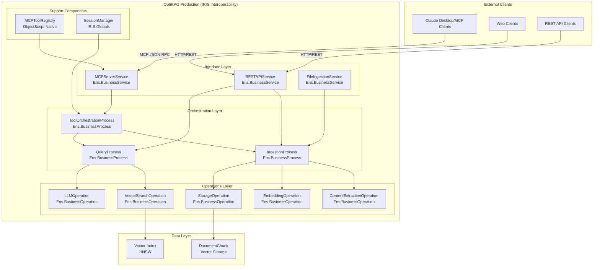

# IRIS Interoperability + MCP Server Integration Design

## Document Overview

**Purpose**: Complete architectural specification for integrating IRIS Interoperability components with Model Context Protocol (MCP) server capabilities in OptiRAG.

**Goals**: 
- Full traceability of all operations through IRIS Management Portal
- ObjectScript-native MCP protocol implementation
- Standards-compliant MCP server for tool registration and execution
- Production-grade error handling, monitoring, and scalability

**Last Updated**: 2025-05-31

---

## Executive Summary

This design creates a unified architecture where OptiRAG operates as both an IRIS Interoperability Production and a standards-compliant MCP Server. Every document ingestion and RAG query operation flows through IRIS Business Services, Processes, and Operations for complete traceability, while exposing RAG capabilities through MCP tools for integration with AI agents like Claude Desktop.

### Key Benefits
- **Full Operational Visibility**: Every MCP tool call visible in IRIS Management Portal traces
- **ObjectScript-Native**: MCP protocol handling without Python dependencies
- **Production-Grade**: Built-in monitoring, error handling, retry logic
- **Standards-Compliant**: Implements MCP specification for tool discovery and execution
- **Minimal External Dependencies**: Python only for content extraction and OpenAI API

---

## Architecture Overview

### Unified System Architecture



### Design Principles

1. **ObjectScript-First Architecture**
   - MCP protocol parsing using %DynamicObject
   - Native IRIS HTTP handling with %CSP.REST
   - Tool registry and session management in ObjectScript
   - STDIO transport using ObjectScript streams

2. **Complete Interoperability Integration**
   - Every operation flows through Business Services/Processes/Operations
   - Full message traceability in Management Portal
   - Performance metrics and timing data
   - Error tracking with detailed context

3. **Minimal Python Dependencies**
   - Python only for: Content extraction (PyPDF2/python-docx), OpenAI API calls
   - ObjectScript for: MCP protocol, routing, orchestration, IRIS operations
   - Leverage IRIS strengths: JSON, HTTP, messaging, vector operations

4. **Standards Compliance**
   - Implements MCP specification JSON-RPC protocol
   - Tool discovery and execution endpoints
   - Session management and authentication hooks
   - Compatible with Claude Desktop and other MCP clients

---

## Component Specifications

### 1. Message Classes

#### MCPToolRequest
```objectscript
Class OptiRAG.Messages.MCPToolRequest Extends Ens.Request
{
    /// Name of the MCP tool to execute
    Property ToolName As %String(MAXLEN = 100) [ Required ];
    
    /// Parameters for the tool as dynamic object
    Property Parameters As %DynamicObject;
    
    /// MCP session identifier
    Property SessionID As %String(MAXLEN = 50);
    
    /// Unique request identifier for tracing
    Property RequestID As %String(MAXLEN = 50);
    
    /// Timestamp when request was received
    Property RequestTime As %TimeStamp [ InitialExpression = {$ZDATETIME($NOW(),3)} ];
    
    /// Client information (User-Agent, etc.)
    Property ClientInfo As %String(MAXLEN = 500);
}
```

#### MCPToolResponse
```objectscript
Class OptiRAG.Messages.MCPToolResponse Extends Ens.Response
{
    /// Tool execution result as dynamic object
    Property Content As %DynamicObject;
    
    /// Indicates if the operation succeeded
    Property IsError As %Boolean [ InitialExpression = 0 ];
    
    /// Error message if operation failed
    Property ErrorMessage As %String(MAXLEN = 2000);
    
    /// Error code for programmatic handling
    Property ErrorCode As %String(MAXLEN = 50);
    
    /// Processing time in milliseconds
    Property ProcessingTime As %Integer;
    
    /// Additional metadata about the response
    Property Metadata As %DynamicObject;
}
```

#### Additional Message Classes
```objectscript
// Document ingestion messages
Class OptiRAG.Messages.IngestionRequest Extends Ens.Request
Class OptiRAG.Messages.IngestionResponse Extends Ens.Response

// Query processing messages  
Class OptiRAG.Messages.QueryRequest Extends Ens.Request
Class OptiRAG.Messages.QueryResponse Extends Ens.Response

// Vector search messages
Class OptiRAG.Messages.VectorSearchRequest Extends Ens.Request
Class OptiRAG.Messages.VectorSearchResponse Extends Ens.Response

// LLM interaction messages
Class OptiRAG.Messages.LLMRequest Extends Ens.Request
Class OptiRAG.Messages.LLMResponse Extends Ens.Response
```

### 2. Business Services

#### MCPServerService
```objectscript
Class OptiRAG.Services.MCPServerService Extends Ens.BusinessService
{
    /// HTTP endpoint for MCP tool discovery
    Method ListTools() As %Status
    {
        Set tools = ##class(OptiRAG.MCP.ToolRegistry).GetToolDefinitions()
        Set response = {
            "tools": (tools),
            "version": "1.0.0",
            "server": "OptiRAG"
        }
        Write response.%ToJSON()
        Return $$$OK
    }
    
    /// HTTP endpoint for MCP tool execution
    Method ExecuteTool(pToolName As %String) As %Status
    {
        Set tSC = $$$OK
        Try {
            // Parse request parameters
            Set params = {}.%FromJSON(%request.Content)
            
            // Create IRIS message for traceability
            Set request = ##class(OptiRAG.Messages.MCPToolRequest).%New()
            Set request.ToolName = pToolName
            Set request.Parameters = params
            Set request.SessionID = $GET(%request.Data("session_id",1))
            Set request.RequestID = $SYSTEM.Util.CreateGUID()
            Set request.ClientInfo = $GET(%request.CgiEnvs("HTTP_USER_AGENT"))
            
            // Send to orchestration process
            Set tSC = ..SendRequestSync("ToolOrchestrationProcess", request, .response)
            If $$$ISERR(tSC) Throw ##class(%Exception.StatusException).CreateFromStatus(tSC)
            
            // Return MCP-compliant response
            If response.IsError {
                Set errorResponse = {
                    "error": {
                        "code": (response.ErrorCode),
                        "message": (response.ErrorMessage)
                    }
                }
                Write errorResponse.%ToJSON()
            } Else {
                Write response.Content.%ToJSON()
            }
            
        } Catch e {
            Set tSC = e.AsStatus()
            Set errorResponse = {
                "error": {
                    "code": "INTERNAL_ERROR",
                    "message": (e.DisplayString())
                }
            }
            Write errorResponse.%ToJSON()
        }
        
        Return tSC
    }
    
    /// STDIO transport handler for command-line MCP server
    Method HandleSTDIOMessage(pMessage As %DynamicObject) As %DynamicObject
    {
        // Implementation for STDIO JSON-RPC transport
        // Converts STDIO messages to IRIS messages for processing
    }
}
```

#### FileIngestionService
```objectscript
Class OptiRAG.Services.FileIngestionService Extends Ens.BusinessService
{
    Parameter ADAPTER = "EnsLib.File.InboundAdapter";
    
    /// Process incoming files automatically
    Method OnProcessInput(pInput As %RegisteredObject, Output pOutput As %RegisteredObject) As %Status
    {
        Set tSC = $$$OK
        Try {
            // Create ingestion request
            Set request = ##class(OptiRAG.Messages.IngestionRequest).%New()
            Set request.Source = pInput.Filename
            Set request.FilePath = pInput.Name
            Set request.ProcessingMode = "AUTO"
            
            // Send to ingestion process
            Set tSC = ..SendRequestAsync("IngestionProcess", request)
            
        } Catch e {
            Set tSC = e.AsStatus()
            Do ..%SetModifiedSyncCommit(1)
        }
        
        Return tSC
    }
}
```

### 3. Business Processes

#### ToolOrchestrationProcess
```objectscript
Class OptiRAG.Processes.ToolOrchestrationProcess Extends Ens.BusinessProcess
{
    /// Route MCP tool calls to appropriate workflows
    Method OnRequest(pRequest As OptiRAG.Messages.MCPToolRequest, Output pResponse As OptiRAG.Messages.MCPToolResponse) As %Status
    {
        Set tSC = $$$OK
        Set pResponse = ##class(OptiRAG.Messages.MCPToolResponse).%New()
        Set startTime = $ZH
        
        Try {
            // Log the tool execution start
            Do ..%Log("MCP Tool Execution Started: " _ pRequest.ToolName)
            
            // Route based on tool name
            If (pRequest.ToolName = "document_ingest") {
                Set tSC = ..ProcessDocumentIngestion(pRequest, .pResponse)
            }
            ElseIf (pRequest.ToolName = "rag_query") {
                Set tSC = ..ProcessRAGQuery(pRequest, .pResponse)
            }
            ElseIf (pRequest.ToolName = "vector_search") {
                Set tSC = ..ProcessVectorSearch(pRequest, .pResponse)
            }
            ElseIf (pRequest.ToolName = "list_documents") {
                Set tSC = ..ProcessListDocuments(pRequest, .pResponse)
            }
            Else {
                Set pResponse.IsError = 1
                Set pResponse.ErrorCode = "UNKNOWN_TOOL"
                Set pResponse.ErrorMessage = "Unknown tool: " _ pRequest.ToolName
            }
            
            // Calculate processing time
            Set pResponse.ProcessingTime = ($ZH - startTime) * 1000
            
            // Log completion
            Do ..%Log("MCP Tool Execution Completed: " _ pRequest.ToolName _ " in " _ pResponse.ProcessingTime _ "ms")
            
        } Catch e {
            Set tSC = e.AsStatus()
            Set pResponse.IsError = 1
            Set pResponse.ErrorCode = "PROCESSING_ERROR"
            Set pResponse.ErrorMessage = e.DisplayString()
            Do ..%LogError("MCP Tool Execution Error", pRequest.ToolName, e.DisplayString())
        }
        
        Return tSC
    }
    
    /// Handle document ingestion tool
    Method ProcessDocumentIngestion(pRequest As OptiRAG.Messages.MCPToolRequest, Output pResponse As OptiRAG.Messages.MCPToolResponse) As %Status
    {
        Set tSC = $$$OK
        Try {
            // Create ingestion request
            Set ingestionRequest = ##class(OptiRAG.Messages.IngestionRequest).%New()
            Set ingestionRequest.Source = pRequest.Parameters.source
            Set ingestionRequest.Metadata = $GET(pRequest.Parameters.metadata)
            
            // Send to ingestion process
            Set tSC = ..SendRequestSync("IngestionProcess", ingestionRequest, .ingestionResponse)
            If $$$ISERR(tSC) Throw ##class(%Exception.StatusException).CreateFromStatus(tSC)
            
            // Build MCP response
            Set pResponse.Content = {
                "result": "success",
                "chunks_created": (ingestionResponse.ChunksCreated),
                "processing_time": (ingestionResponse.ProcessingTime),
                "source": (ingestionResponse.Source)
            }
            
        } Catch e {
            Set tSC = e.AsStatus()
            Set pResponse.IsError = 1
            Set pResponse.ErrorMessage = e.DisplayString()
        }
        
        Return tSC
    }
    
    /// Handle RAG query tool
    Method ProcessRAGQuery(pRequest As OptiRAG.Messages.MCPToolRequest, Output pResponse As OptiRAG.Messages.MCPToolResponse) As %Status
    {
        Set tSC = $$$OK
        Try {
            // Create query request
            Set queryRequest = ##class(OptiRAG.Messages.QueryRequest).%New()
            Set queryRequest.Query = pRequest.Parameters.query
            Set queryRequest.MaxResults = $GET(pRequest.Parameters.max_results, 5)
            Set queryRequest.MinScore = $GET(pRequest.Parameters.min_score, 0.7)
            
            // Send to query process
            Set tSC = ..SendRequestSync("QueryProcess", queryRequest, .queryResponse)
            If $$$ISERR(tSC) Throw ##class(%Exception.StatusException).CreateFromStatus(tSC)
            
            // Build MCP response
            Set pResponse.Content = {
                "answer": (queryResponse.Answer),
                "sources": (queryResponse.Sources),
                "confidence": (queryResponse.Confidence),
                "chunks_used": (queryResponse.ChunksUsed)
            }
            
        } Catch e {
            Set tSC = e.AsStatus()
            Set pResponse.IsError = 1
            Set pResponse.ErrorMessage = e.DisplayString()
        }
        
        Return tSC
    }
}
```

#### QueryProcess
```objectscript
Class OptiRAG.Processes.QueryProcess Extends Ens.BusinessProcess
{
    /// Orchestrate RAG query processing
    Method OnRequest(pRequest As OptiRAG.Messages.QueryRequest, Output pResponse As OptiRAG.Messages.QueryResponse) As %Status
    {
        Set tSC = $$$OK
        Set pResponse = ##class(OptiRAG.Messages.QueryResponse).%New()
        
        Try {
            // Step 1: Vector search for relevant chunks
            Set searchRequest = ##class(OptiRAG.Messages.VectorSearchRequest).%New()
            Set searchRequest.Query = pRequest.Query
            Set searchRequest.MaxResults = pRequest.MaxResults
            Set searchRequest.MinScore = pRequest.MinScore
            
            Set tSC = ..SendRequestSync("VectorSearchOperation", searchRequest, .searchResponse)
            If $$$ISERR(tSC) Throw ##class(%Exception.StatusException).CreateFromStatus(tSC)
            
            // Step 2: Generate answer using LLM
            Set llmRequest = ##class(OptiRAG.Messages.LLMRequest).%New()
            Set llmRequest.Query = pRequest.Query
            Set llmRequest.Context = searchResponse.Chunks
            Set llmRequest.Model = "gpt-4"
            
            Set tSC = ..SendRequestSync("LLMOperation", llmRequest, .llmResponse)
            If $$$ISERR(tSC) Throw ##class(%Exception.StatusException).CreateFromStatus(tSC)
            
            // Build response
            Set pResponse.Answer = llmResponse.Answer
            Set pResponse.Sources = searchResponse.Sources
            Set pResponse.Confidence = searchResponse.OverallScore
            Set pResponse.ChunksUsed = searchResponse.ChunkCount
            
        } Catch e {
            Set tSC = e.AsStatus()
            Set pResponse.IsError = 1
            Set pResponse.ErrorMessage = e.DisplayString()
        }
        
        Return tSC
    }
}
```

### 4. Business Operations

#### VectorSearchOperation
```objectscript
Class OptiRAG.Operations.VectorSearchOperation Extends Ens.BusinessOperation
{
    /// Perform vector similarity search
    Method OnMessage(pRequest As OptiRAG.Messages.VectorSearchRequest, Output pResponse As OptiRAG.Messages.VectorSearchResponse) As %Status
    {
        Set tSC = $$$OK
        Set pResponse = ##class(OptiRAG.Messages.VectorSearchResponse).%New()
        
        Try {
            // Use existing DocumentChunk.FindSimilar method
            Set results = ##class(OptiRAG.KnowledgeBase.DocumentChunk).FindSimilar(
                pRequest.Query, 
                pRequest.MaxResults, 
                pRequest.MinScore
            )
            
            // Convert results to response format
            Set chunks = []
            Set sources = []
            Set totalScore = 0
            
            For i = 1:1:results.Count() {
                Set result = results.GetAt(i)
                
                Set chunk = {
                    "content": (result.content),
                    "source": (result.source),
                    "score": (result.score),
                    "metadata": (result.metadata)
                }
                Do chunks.%Push(chunk)
                
                Set source = {
                    "name": (result.source),
                    "score": (result.score)
                }
                Do sources.%Push(source)
                
                Set totalScore = totalScore + result.score
            }
            
            Set pResponse.Chunks = chunks
            Set pResponse.Sources = sources
            Set pResponse.ChunkCount = results.Count()
            Set pResponse.OverallScore = totalScore / results.Count()
            
        } Catch e {
            Set tSC = e.AsStatus()
            Set pResponse.IsError = 1
            Set pResponse.ErrorMessage = e.DisplayString()
        }
        
        Return tSC
    }
}
```

#### LLMOperation
```objectscript
Class OptiRAG.Operations.LLMOperation Extends Ens.BusinessOperation
{
    /// Generate answer using LLM with retrieved context
    Method OnMessage(pRequest As OptiRAG.Messages.LLMRequest, Output pResponse As OptiRAG.Messages.LLMResponse) As %Status
    {
        Set tSC = $$$OK
        Set pResponse = ##class(OptiRAG.Messages.LLMResponse).%New()
        
        Try {
            // Build context from chunks
            Set context = ""
            Set iterator = pRequest.Context.%GetIterator()
            While iterator.%GetNext(.key, .chunk) {
                Set context = context _ "Source: " _ chunk.source _ $C(10)
                Set context = context _ chunk.content _ $C(10,10)
            }
            
            // Build prompt
            Set prompt = "Based on the following context, answer the question. If the answer cannot be found in the context, say so." _ $C(10,10)
            Set prompt = prompt _ "Context:" _ $C(10) _ context _ $C(10)
            Set prompt = prompt _ "Question: " _ pRequest.Query _ $C(10,10)
            Set prompt = prompt _ "Answer:"
            
            // Call OpenAI API (using existing pattern from embedding operations)
            Set answer = ..CallOpenAIAPI(prompt, pRequest.Model)
            
            Set pResponse.Answer = answer
            Set pResponse.TokensUsed = $LENGTH(prompt) / 4  // Rough estimate
            Set pResponse.Model = pRequest.Model
            
        } Catch e {
            Set tSC = e.AsStatus()
            Set pResponse.IsError = 1
            Set pResponse.ErrorMessage = e.DisplayString()
        }
        
        Return tSC
    }
    
    /// Call OpenAI API for text generation
    Method CallOpenAIAPI(pPrompt As %String, pModel As %String) As %String
    {
        // Implementation using embedded Python or HTTP requests
        // Similar pattern to existing OpenAI integration
    }
}
```

### 5. MCP Tool Registry

```objectscript
Class OptiRAG.MCP.ToolRegistry Extends %RegisteredObject
{
    /// Get all available MCP tools with their schemas
    ClassMethod GetToolDefinitions() As %DynamicArray
    {
        Set tools = []
        
        // Document ingestion tool
        Set ingestTool = {
            "name": "document_ingest",
            "description": "Ingest documents into the OptiRAG knowledge base",
            "inputSchema": {
                "type": "object",
                "properties": {
                    "source": {
                        "type": "string",
                        "description": "File path or URL to ingest"
                    },
                    "metadata": {
                        "type": "object",
                        "description": "Additional metadata for the document"
                    }
                },
                "required": ["source"]
            }
        }
        Do tools.%Push(ingestTool)
        
        // RAG query tool
        Set queryTool = {
            "name": "rag_query",
            "description": "Query the knowledge base using retrieval-augmented generation",
            "inputSchema": {
                "type": "object",
                "properties": {
                    "query": {
                        "type": "string",
                        "description": "Question to ask the knowledge base"
                    },
                    "max_results": {
                        "type": "integer",
                        "description": "Maximum number of chunks to retrieve",
                        "default": 5
                    },
                    "min_score": {
                        "type": "number",
                        "description": "Minimum similarity score (0-1)",
                        "default": 0.7
                    }
                },
                "required": ["query"]
            }
        }
        Do tools.%Push(queryTool)
        
        // Vector search tool
        Set searchTool = {
            "name": "vector_search",
            "description": "Search for similar documents using vector similarity",
            "inputSchema": {
                "type": "object",
                "properties": {
                    "query": {
                        "type": "string",
                        "description": "Search query"
                    },
                    "max_results": {
                        "type": "integer",
                        "description": "Maximum results to return",
                        "default": 10
                    }
                },
                "required": ["query"]
            }
        }
        Do tools.%Push(searchTool)
        
        // List documents tool
        Set listTool = {
            "name": "list_documents",
            "description": "List all documents in the knowledge base",
            "inputSchema": {
                "type": "object",
                "properties": {
                    "limit": {
                        "type": "integer",
                        "description": "Maximum number of documents to return",
                        "default": 50
                    },
                    "source_filter": {
                        "type": "string",
                        "description": "Filter by source name (optional)"
                    }
                }
            }
        }
        Do tools.%Push(listTool)
        
        Return tools
    }
    
    /// Validate tool request parameters against schema
    ClassMethod ValidateToolRequest(pToolName As %String, pParameters As %DynamicObject) As %Status
    {
        // Implementation for JSON schema validation
        // Ensures MCP tool calls have correct parameters
    }
}
```

---

## Implementation Phases

### Phase 1: MCP Message Foundation
**Duration**: 2-3 days
**Deliverables**:
- All message classes (MCPToolRequest, MCPToolResponse, etc.)
- ToolOrchestrationProcess with basic routing
- MCPToolRegistry with tool definitions
- Basic unit tests

**Acceptance Criteria**:
- Message classes compile and pass basic validation
- ToolOrchestrationProcess can route to mock destinations
- Tool registry returns valid MCP tool schemas

### Phase 2: HTTP Transport
**Duration**: 2-3 days
**Deliverables**:
- MCPServerService with HTTP endpoints
- REST endpoint routing to Business Services
- Session management infrastructure
- HTTP transport testing

**Acceptance Criteria**:
- MCP tool discovery endpoint returns valid tool list
- Tool execution endpoint accepts and processes requests
- Full request/response flow through Interoperability visible in traces

### Phase 3: Interoperability Integration
**Duration**: 3-4 days
**Deliverables**:
- Integration with existing DocumentProcessor/EmbeddingGenerator
- QueryProcess and VectorSearchOperation
- LLMOperation for answer generation
- Production configuration

**Acceptance Criteria**:
- Document ingestion tool works end-to-end
- RAG query tool returns relevant answers
- All operations visible in Management Portal traces
- Error handling and retry logic functional

### Phase 4: STDIO Transport & Polish
**Duration**: 2-3 days
**Deliverables**:
- STDIO JSON-RPC transport handler
- Command-line MCP server executable
- Authentication and security features
- Performance optimization and monitoring

**Acceptance Criteria**:
- Command-line MCP server compatible with Claude Desktop
- Authentication mechanisms functional
- Performance meets requirements (<2s for typical queries)
- Documentation complete

---

## Configuration & Deployment

### Production Configuration

```objectscript
Class OptiRAG.Production.OptiRAGProduction Extends Ens.Production
{
    XData ProductionDefinition
    {
        <Production Name="OptiRAG.Production.OptiRAGProduction">
            <!-- MCP Interface -->
            <Item Name="MCPServerService" Category="Interface" ClassName="OptiRAG.Services.MCPServerService">
                <Setting Target="Host" Name="HTTPPort">8080</Setting>
                <Setting Target="Host" Name="EnableSTDIO">1</Setting>
            </Item>
            
            <!-- Ingestion Services -->
            <Item Name="FileIngestionService" Category="Ingestion" ClassName="OptiRAG.Services.FileIngestionService">
                <Setting Target="Adapter" Name="FilePath">/opt/optirag/inbox/</Setting>
                <Setting Target="Adapter" Name="FileSpec">*.pdf;*.docx;*.html;*.txt</Setting>
            </Item>
            
            <!-- Orchestration Processes -->
            <Item Name="ToolOrchestrationProcess" Category="Process" ClassName="OptiRAG.Processes.ToolOrchestrationProcess">
                <Setting Target="Host" Name="PoolSize">5</Setting>
            </Item>
            
            <Item Name="IngestionProcess" Category="Process" ClassName="OptiRAG.Processes.IngestionProcess">
                <Setting Target="Host" Name="PoolSize">3</Setting>
            </Item>
            
            <Item Name="QueryProcess" Category="Process" ClassName="OptiRAG.Processes.QueryProcess">
                <Setting Target="Host" Name="PoolSize">10</Setting>
            </Item>
            
            <!-- Specialized Operations -->
            <Item Name="ContentExtractionOperation" Category="Operation" ClassName="OptiRAG.Operations.ContentExtractionOperation" />
            <Item Name="EmbeddingOperation" Category="Operation" ClassName="OptiRAG.Operations.EmbeddingOperation" />
            <Item Name="StorageOperation" Category="Operation" ClassName="OptiRAG.Operations.StorageOperation" />
            <Item Name="VectorSearchOperation" Category="Operation" ClassName="OptiRAG.Operations.VectorSearchOperation" />
            <Item Name="LLMOperation" Category="Operation" ClassName="OptiRAG.Operations.LLMOperation">
                <Setting Target="Host" Name="OpenAIModel">gpt-4</Setting>
                <Setting Target="Host" Name="MaxTokens">2000</Setting>
            </Item>
        </Production>
    }
}
```

### REST API Routing

```objectscript
Class OptiRAG.REST.MCPEndpoint Extends %CSP.REST
{
    XData UrlMap
    {
        <Routes>
            <!-- MCP Protocol Endpoints -->
            <Route Url="/mcp/tools" Method="GET" Call="ListTools"/>
            <Route Url="/mcp/tools/:tool" Method="POST" Call="ExecuteTool"/>
            <Route Url="/mcp/sessions" Method="POST" Call="CreateSession"/>
            
            <!-- Direct API Endpoints -->
            <Route Url="/api/ingest" Method="POST" Call="IngestDocument"/>
            <Route Url="/api/query" Method="POST" Call="QueryKnowledgeBase"/>
            <Route Url="/api/search" Method="POST" Call="VectorSearch"/>
            <Route Url="/api/documents" Method="GET" Call="ListDocuments"/>
        </Routes>
    }
}
```

---

## Monitoring & Observability

### Key Metrics
- **MCP Tool Execution Times**: P50, P95, P99 latencies
- **Document Ingestion Rate**: Documents/minute, chunks created
- **Query Success Rate**: Successful vs. failed queries
- **Vector Search Performance**: Similarity search latency
- **LLM Token Usage**: Total tokens, cost tracking
- **Error Rates**: By component and error type

### Alerting Rules
- Query latency > 5 seconds
- Error rate > 5% over 5 minutes
- Document ingestion failures
- Vector search timeouts
- LLM API failures

### Dashboards
- **Real-time Operations**: Live view of MCP tool executions
- **Performance Metrics**: Latency trends and throughput
- **Error Analysis**: Error patterns and troubleshooting
- **Resource Utilization**: Memory, CPU, and storage usage

---

## Security Considerations

### Authentication
- API key validation for MCP clients
- Session-based authentication for web interfaces
- Role-based access control for different tool types

### Authorization
- Tool-level permissions (read-only vs. write access)
- Source-based filtering (restrict access to specific documents)
- Rate limiting per client/session

### Data Protection
- Encryption in transit (HTTPS/TLS)
- Sensitive data masking in logs
- Audit trail for all operations

---

## Conclusion

This unified architecture provides OptiRAG with enterprise-grade capabilities while maintaining full compatibility with MCP standards. The design leverages IRIS strengths (Interoperability, vector operations, native JSON) while minimizing external dependencies. Every operation flows through IRIS Business Services for complete traceability, making it ideal for production environments requiring operational visibility
